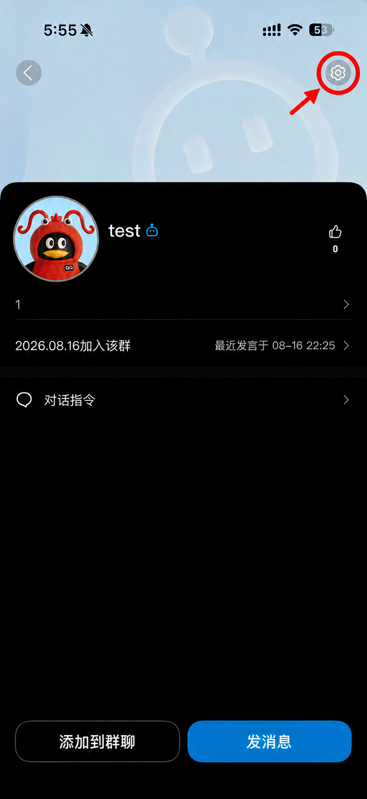
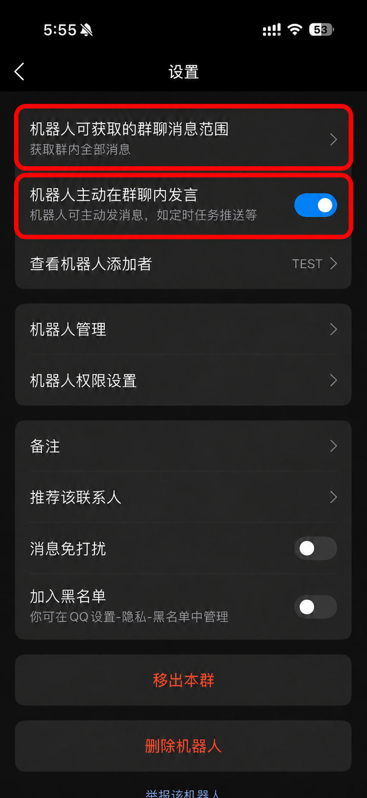

# HuHoBotSetup Addon

在游戏内配置 HuHoBot，并通过一次确认接入 QQ 群，**不需要查询、复制或手填群 OpenID**。

这是独立的 Paper / Spigot 插件，需要配合 [HuHoBot Penguin](https://github.com/HuHoBot/PenguinClient) 的 Spigot 端使用，不替换机器人主体。目前版本为 **0.1.0-beta.1**。

## 怎么使用

1. 将构建得到的 `HuHoBotSetup-0.1.0-beta.1.jar` 放进服务器的 `plugins` 文件夹，与 HuHoBot 主插件一起启动。
2. 由有权限的玩家在游戏内执行 `/huhobotsetup`，填写 AppID、Secret 和机器人名称。
3. 保存后进入添加群流程，到目标 QQ 群 **@机器人发送一条消息**。
4. 回到游戏，核对发送者和消息内容，点击“确认绑定”。只有发起本次接入的玩家可以确认。
5. 插件自动保存群配置，并在 QQ 群发送权限设置指引。

新版服务端会优先打开原生表单；没有对应接口时，会自动使用箱子菜单和三页配置书。使用配置书时依次填写 AppID、Secret 和机器人名称，检查后提交即可。

首次填入完整凭据后，插件会尝试立即启动 QQ 客户端。更换已连接的机器人账号时，需要按提示重启服务器。

## 环境要求

- 安装并启用插件名为 `HuHoBotPenguin` 的 HuHoBot Spigot 端。
- 本插件以 Spigot API 1.16.5 为编译基线；实际 Minecraft 和 Java 版本还需满足 HuHoBot 主插件要求。
- Paper / Spigot 原生 Dialog 通过运行时检测启用，不可用时自动回退。
- 群接入需要主插件提供 `OnBotRecvMsg` 群消息事件、消息读取和文本回复能力；缺少被动图片回复接口时，权限指引会回退为文字。
- 本仓库不将上述接口检测等同于对所有服务端或 HuHoBot 衍生版本的兼容保证。

权限节点：`huhobot.setup`，默认仅 OP 可用。只应授予可信的服务器管理员。

## QQ 权限设置

接入后，请群主或管理员根据需要开启“获取群内全部消息”和“机器人主动在群聊内发言”。接入本身使用收到的消息进行被动回复，不要求事先开启主动推送。

<p>
  
  
</p>

不同 QQ 版本的界面可能不同，图片仅作位置参考。没有对应设置入口时，请先更新 QQ；相关权限未开放时，不应将接入成功理解为主动推送已可用。

## 常用命令

| 命令 | 用途 |
| --- | --- |
| `/huhobotsetup` | 打开配置和群接入向导 |
| `/huhobotsetup status` | 查看配置状态，不显示完整 Secret |
| `/huhobotsetup cancel` | 取消当前配置或等待接入流程 |

`/hbsetup` 是简写。排查界面问题时可使用 `/huhobotsetup ui auto`、`ui dialog` 或 `ui menu`，选择仅在当前服务器运行期间有效。

如果无法使用确认式接入，可执行 `/huhobotsetup group-code` 获取一次性接入码，再在目标群发送 `@机器人 /接入ABCD-EFGH-JKLM`。接入码属于临时授权凭证，请勿公开转发。

## 配置与注意事项

本插件的设置位于 `plugins/HuHoBotSetup/config.yml`：

| 配置项 | 默认值 | 说明 |
| --- | --- | --- |
| `enrollment.waiting-expiry-seconds` | `600` | 等待目标群消息的时间（秒） |
| `enrollment.confirmation-expiry-seconds` | `120` | 游戏内确认请求的有效时间（秒） |
| `enrollment.code-expiry-seconds` | `600` | 备用接入码的有效时间（秒） |
| `enrollment.block-unconfirmed-groups` | `true` | 尚未接入任何群时，拦截普通群指令 |

- 等待窗口一次只捕获一个未接入群的候选请求。部分事件没有保留 @ 标记，因此务必核对消息内容，不要盲目确认。
- Secret 不通过普通聊天或命令参数提交。保存机器人凭据前会尝试备份主插件配置；备份失败会记录警告，因此重要配置仍应自行备份。
- 主插件配置及其备份可能包含 Secret，应限制访问，不要上传到公开仓库。配置表单、配置书及其截图也应视为敏感内容。
- 配置书在正常完成、取消、退出或插件关闭时会清理，并恢复原有手持物品；异常崩溃场景不作恢复保证。
- 保存时会为尚未自定义的“查在线”配置补齐兼容文本回执，已有图片或 Markdown 设置不会因此被覆盖。
- 本插件没有 AI 对话功能，也不负责替 QQ 开放平台授予权限。

## 从源码构建

使用 JDK 21 和仓库自带的 Gradle Wrapper，不需要另外下载 HuHoBot 源码。

Windows：

```powershell
.\gradlew.bat test build
```

Linux / macOS：

```sh
./gradlew test build
```

构建产物：`build/libs/HuHoBotSetup-0.1.0-beta.1.jar`。单元测试覆盖配置数据、消息解析和部分界面辅助逻辑；原生表单、QQ 权限和真实接入流程仍需在服务器中测试。

## 许可证

沿用 HuHoBot 主项目的 GNU Affero General Public License v3.0，详见 [LICENSE.txt](LICENSE.txt)。QQ 界面截图仅用于操作指引，相关界面及标识归其权利人所有。
